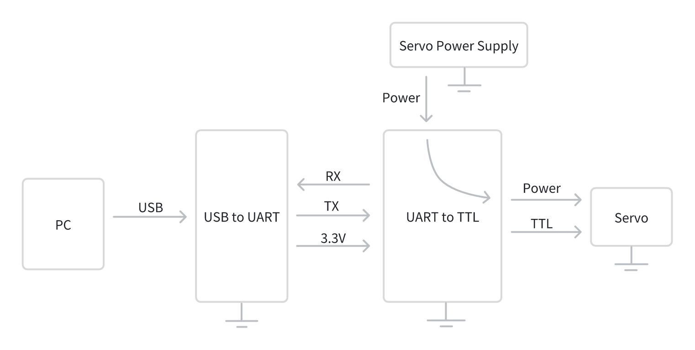
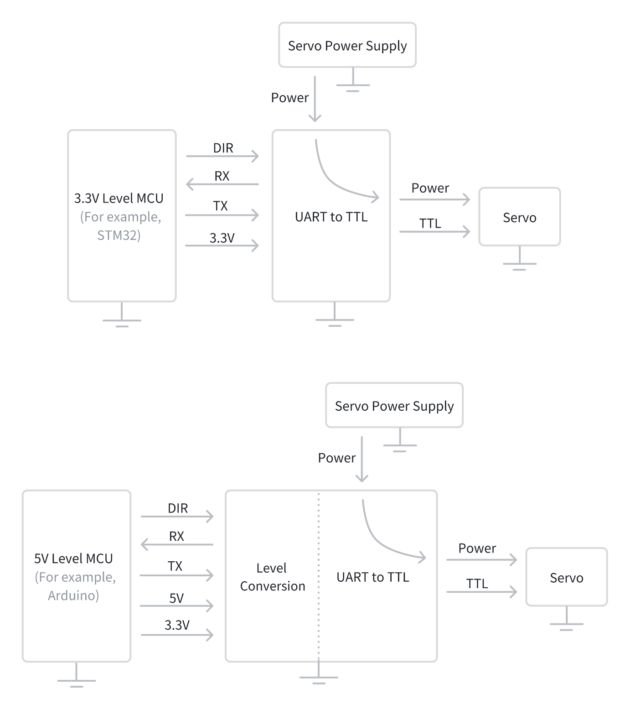

# ServoSDK
Welcome to ServoSDK, an open-source software development kit designed specifically for the Energize Lab Servo. This SDK provides multi-language, multi-platform servo usage examples and motion control demos, aimed at helping users easily and quickly master the use of various models, including the EM-2030. It is strongly recommended to refer to the corresponding memory table parameter for understanding and verification.
- Supported Protocols:
  - Energize Lab Servo Communication Protocol  
- Supported Memory Tables: 
  - Primary Memory Table 
- Supported Servos:  
  - EM Series, EH-3030 
- Supported Programming Languages:
  - Arduino: Includes source code, with compatible examples and demos across multiple platforms.
  - C: Includes source code, with examples and demos based on Windows, STC89C52, and STM32F103C8T6.
  - C++: Includes source code, with examples and demos based on Windows.
  - MicroPython: Includes source code, with examples and demos based on ESP32.
  - Python: Includes source code, with examples and demos based on Windows.

## Repository
- File Structure: 
  - ServoSDK -> Programming Language -> Src & Development Environment  -> Memory Table (-> Example & Demo)
- File Description: 
  - Src: Source code that includes instruction generation and parsing for the entire memory table of servo.
  - Example: Demonstrate the use of Ping instruction, read data instruction, write data instruction, sync write instruction, parameter reset instruction, factory reset instruction, and reboot instruction.
  - Demo: Demonstrate the motion of the servo in different control modes.

## Servo Preparation
To run the ServoSDK Example and Demo, you need to change the following parameters of the servo:
- ID = 1 (for testing Sync Write instruction, use 1 and 2 respectively)
- Baud Rate = 1 Mbps (the corresponding value in the memory table is 7, which usually doesn't need to be changed)
To change the servo parameters, please use ServoStudio or ServoCommand. Refer to the corresponding user manual for details.

## Communication Circuits
- Servo and PC Communication
  -To enable communication between the Energize Lab Servo and a PC, a UART to TTL module and a USB to UART module is required, as illustrated in the diagram below:  

- Servo and MCU Communication
  -To enable communication between the Energize Lab Servo and the MCU, a UART to TTL module is needed; if the MCU operates at 5V, a level shifting module is also necessary, as illustrated in the diagram below:  

